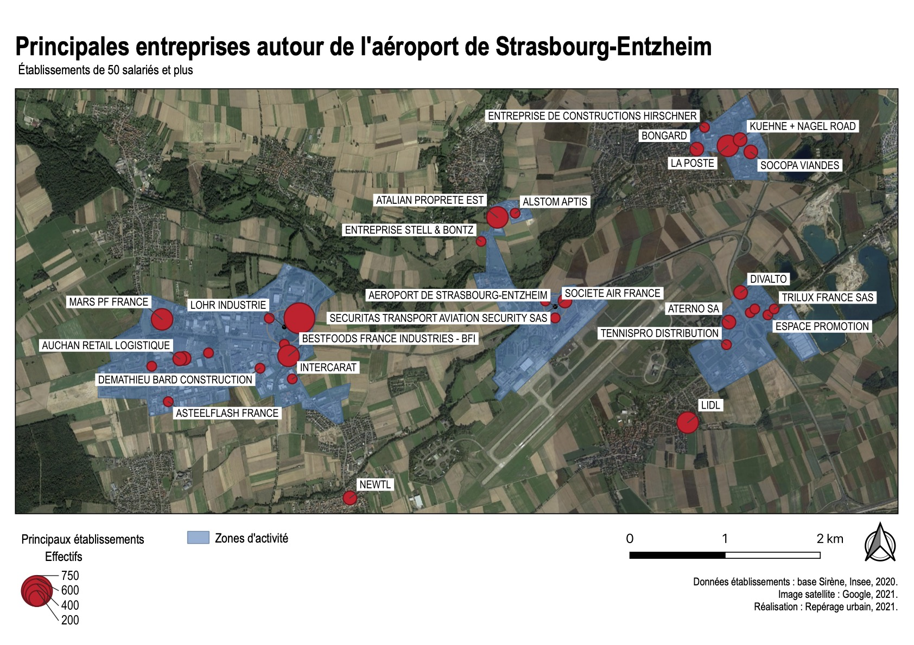

```{r setup, include=FALSE}
knitr::opts_chunk$set(echo = TRUE)
library(tidyverse)
library(tidyselect)
library(tidyr)
library(stringr)
library(vroom)
library(readxl)
library(haven)
library(labelled)
library(sjlabelled)
library(httr)
library(jsonlite)
library(huxtable)
library(gtsummary)
library(sf)
library(openxlsx)
```

# Constitution de la base

## Fichier SIRENE des établissements dans la zone

On commence par interroger la base SIRENE des établissements situés dans les communes concernées : <https://www.sirene.fr/sirene/public/creation-fichier>.

Les communes demandées sont :

- ENTZHEIM
- HANGENBIETEN
- DUTTLENHEIM
- DUPPIGHEIM
- ERNOLSHEIM-BRUCHE
- HOLTZHEIM
- WOLFISHEIM

Le fichier correspondant est placé dans `data/tables/sirene-all.csv`.
La liste des variables est disponible sur : <https://www.sirene.fr/sirene/public/static/liste-variables>.

## Géocodage du fichier SIRENE

On géocode le fichier grâce au service disponible sur <https://adresse.data.gouv.fr/csv>.
Critères :

- numeroVoieEtablissement
- typeVoieEtablissement
- libelleVoieEtablissement
- complementAdresseEtablissement
- codePostalEtablissement
- libelleCommuneEtablissement

Paramètres avancés : code INSEE = codeCommuneEtablissement.

Le fichier correspondant est placé dans `data/tables/sirene-all-geocoded.csv`.

## Nettoyage du fichier SIRENE

On importe le fichier `data/tables/sirene-all.geocoded.csv` dans R, en ne garde que les colonnes qui nous intéressent.

```{r import_sanitize_etablissements, cache=TRUE, echo=FALSE}
# Import de la base SIRENE
# Ajout des codes NAF
# Ajout des étiquettes (nb employés)
source("source/functions/import_sirene_with_labels.R")

# Correction du géocodage : Aéroport de Strasbourg
source("source/functions/correct_geoloc_airport.R")

sirene_all <- import_sirene_with_labels() %>%
  correct_geoloc_airport(long = "7.62522", lat = "48.54601")
```

Il y a `r nrow(sirene_all)` établissements dans les communes de la zone.

## Chiffres d'affaires par SIREN

On récupère les chiffres clés 2019-2018-2017 des entreprises en France sur <https://opendata.datainfogreffe.fr/explore/dataset/chiffres-cles-2020> et on les place dans `data/tables/chiffres-cles-2019.csv`. On importe ce fichier dans R, et on le joint au tableau des établissements. (On ne prend pas 2020 parce que beaucoup d'entreprises n'ont pas encore déposé leurs comptes et donc ne sont pas dans le fichier 2020)

```{r import_sanitize_chiffres_cles, cache=TRUE, include=FALSE}
source("source/functions/add_ca.R")
sirene_all <- sirene_all %>%
  add_ca()
```
## Filtres

On enlève les entreprises sans employés, les entreprises unipersonnelles, les entreprises de droit public/administratif, les établissements publics des cultes d'Alsace-Lorraine.

```{r filter_employee, cache=TRUE, echo=FALSE}
# Dictionnaire des catégories juridiques : https://www.insee.fr/fr/information/2028129

sirene <- sirene_all %>%
  # PAS moins de 10 employés
  filter(!trancheEffectifsEtablissement %in% c("NN", "00", "01", "02", "03")) %>%
  filter(!is.na(trancheEffectifsEtablissement)) %>%
  # PAS Entreprises unipersonnelles
  filter(!categorieJuridiqueUniteLegale == "1000") %>%
  # PAS public/droit adminitratif
  filter(!between(as.numeric(categorieJuridiqueUniteLegale), 7000, 7999)) %>%
  # PAS administration publique
  filter(!sectionActivitePrincipaleUniteLegale == "O") %>%
  # PAS Établissement public des cultes d'Alsace-Lorraine 
  filter(!categorieJuridiqueUniteLegale == "7430")
```

Il y a `r nrow(sirene)` établissements ciblés dans les communes de la zone.

## Zones d'activités ciblées

Dans qgis, on dessine les zones d'activité et on enregistre la couche dans `data/spatial/zonesdactivite/zonesdactivite.shp`. Puis on l'importe dans R et on demande les établissements qui sont dans les polygones dessinés.
```{r zones_dactivite, cache=TRUE, echo=FALSE, message=FALSE, warning=FALSE}
sirene <- sirene %>%
  full_join(
    st_intersection(
      st_as_sf(
        sirene,
        coords = c("longitude", "latitude"),
        crs = 4326,
        agr = "constant"
      ),
      read_sf("data/spatial/zonesdactivite/zones_d_activite.shp")
    ) %>%
    st_drop_geometry() %>%
    rename(nom_zone_d_activite = nom)
  ) %>%
  # On ne garde de Wolfisheim que les établissements dans la ZA de Holtzheim
  filter(
    !(
      (libelleCommuneEtablissement == "WOLFISHEIM")
      & is.na(nom_zone_d_activite)
    )
  ) %>%
  mutate(
    localisation = ifelse(
      is.na(nom_zone_d_activite),
      paste0("Village-", libelleCommuneEtablissement),
      nom_zone_d_activite
    )
  )
```

Il y a `r nrow(sirene %>% filter(!is.na(nom_zone_d_activite)))` établissements ciblés dans les zones d'activité étudiées.

## Export

Le fichier des établissements de la zone est exporté dans le fichier `data/tables/etablissements.xlsx`.
```{r export_qgis, cache=TRUE, echo=FALSE}
sirene_export_tableau <- sirene %>%
  mutate(
    complementAdresseEtablissement = tidyr::replace_na(complementAdresseEtablissement, ""),
    numeroVoieEtablissement = tidyr::replace_na(numeroVoieEtablissement, ""),
    typeVoieEtablissement = tidyr::replace_na(typeVoieEtablissement, ""),
    libelleVoieEtablissement = tidyr::replace_na(libelleVoieEtablissement, ""),
    distributionSpecialeEtablissement = tidyr::replace_na(distributionSpecialeEtablissement, "")
  ) %>%
  mutate(
    adresse = stringr::str_trim(paste(
      complementAdresseEtablissement,
      numeroVoieEtablissement,
      typeVoieEtablissement,
      libelleVoieEtablissement,
      distributionSpecialeEtablissement,
      ifelse(
        is.na(codeCedexEtablissement),
        codePostalEtablissement,
        codeCedexEtablissement
      ),
      ifelse(
        is.na(libelleCedexEtablissement),
        libelleCommuneEtablissement,
        libelleCedexEtablissement
      )
    ))
  ) %>%
  select(
    siret,
    siren,
    denominationUniteLegale,
    localisation,
    trancheEffectifsEtablissement,
    localisation,
    libelleActivitePrincipaleUniteLegale,
    libelleSectionActivitePrincipaleUniteLegale,
    CA,
    latitude,
    longitude
  )
sirene_export_map <- sirene_export_tableau %>%
  sjlabelled::val_labels(
    trancheEffectifsEtablissement = c(
      "NN" = "0",
      "00" = "0",
      "01" = "1",
      "02" = "3",
      "03" = "6",
      "11" = "15",
      "12" = "35",
      "21" = "75",
      "22" = "150",
      "31" = "225",
      "32" = "375",
      "41" = "750",
      "42" = "1500",
      "51" = "3500",
      "52" = "7500",
      "53" = "10000"
    )
  ) %>%
  mutate(
    trancheEffectifsEtablissementNum = sjlabelled::as_label(
      trancheEffectifsEtablissement
    )
  )

sirene_export_tableau <- sirene_export_tableau %>%
  mutate(trancheEffectifsEtablissement = sjlabelled::as_label(
    trancheEffectifsEtablissement,
    prefix = TRUE
  )) %>%
  select(-latitude, -longitude) %>%
  rename(
    "Siren" = siren,
    "Siret" = siret,
    "Nom de l'entreprise" = denominationUniteLegale,
    "Localisation" = localisation,
    "Tranche d'effectif" = trancheEffectifsEtablissement,
    "Activité" = libelleActivitePrincipaleUniteLegale,
    "Domaine" = libelleSectionActivitePrincipaleUniteLegale,
    "Chiffre d'affaires" = CA
  )
sirene_naf <- sirene %>%
  select(
    siren,
    denominationUniteLegale,
    libelleActivitePrincipaleUniteLegale,
    naf.niv4.libelle,
    naf.niv3.libelle,
    naf.niv2.libelle,
    libelleSectionActivitePrincipaleUniteLegale
  )
write.xlsx(sirene_export_tableau, "data/tables/etablissements.xlsx")
write_excel_csv(sirene_export_map, "data/spatial/etablissements.csv", na = "")

write.xlsx(sirene_naf, "data/tables/etablissements_naf.xlsx")

```

# Carte



# Statistiques

## Dans les communes cibles

### Domaines d'activité
```{r naf_niv1_communes, echo=FALSE, message=FALSE}
sirene %>% tbl_summary(
  include = c(libelleSectionActivitePrincipaleUniteLegale),
  label = list(libelleSectionActivitePrincipaleUniteLegale ~ "NAF niveau 1"),
  sort = list(everything() ~ "frequency")
) %>%
  bold_labels()
```

```{r naf_niv5_communes, echo=FALSE, message=FALSE}
# sirene %>% tbl_summary(
#   include = c(libelleActivitePrincipaleUniteLegale,
#               libelleSectionActivitePrincipaleUniteLegale),
#   label = list(libelleActivitePrincipaleUniteLegale ~ "NAF niveau 5"),
#   sort = list(everything() ~ "frequency")
# ) %>%
#   bold_labels()
```

### Effectifs
```{r effectifs_etablissements_communes, echo=FALSE, message=FALSE}
sirene %>%
  mutate(
    trancheEffectifsEtablissement = sjlabelled::as_label(drop_labels(
      trancheEffectifsEtablissement
    ))
  ) %>%
  tbl_summary(
    include = c("trancheEffectifsEtablissement"),
    #sort = list(everything() ~ "frequency")
  ) %>%
  bold_labels()
```

### Chiffre d'affaires
```{r ca_entreprises_communes, echo=FALSE, message=FALSE}
sirene %>% tbl_summary(
  include = c("CA")
) %>%
  bold_labels()
```

## Dans les zones d'activité cibles

### Nombre d'établissements
```{r nb_par_za, echo=FALSE, message=FALSE}
sirene %>%
  tbl_summary(
    include = c("nom_zone_d_activite"),
    label = list(nom_zone_d_activite ~ "Zone d'activité"),
    sort = list(everything() ~ "frequency")
  )
```

### Domaines d'activités
```{r codes_naf_by_za, echo=FALSE, message=FALSE}
sirene %>%
  rename("NAF niveau 1" = libelleSectionActivitePrincipaleUniteLegale) %>%
  tbl_summary(
    include = c(
      nom_zone_d_activite,
      "NAF niveau 1"
    ),
    by = nom_zone_d_activite,
    sort = list(everything() ~ "frequency")
  ) %>%
  add_overall(col_label = "Toutes ZA") %>%
  bold_labels()
```

### Effectifs
```{r effectifs_etablissements_by_za, echo=FALSE, message=FALSE}
sirene %>%
  mutate(
    trancheEffectifsEtablissement = sjlabelled::as_label(
      trancheEffectifsEtablissement
    ),
    trancheEffectifsUniteLegale = sjlabelled::as_label(
      trancheEffectifsUniteLegale
    )
  ) %>%
  tbl_summary(
    include = c(
      nom_zone_d_activite,
      trancheEffectifsEtablissement,
      trancheEffectifsUniteLegale,
    ),
    by = nom_zone_d_activite
  ) %>%
  add_overall(col_label = "Toutes ZA") %>%
  bold_labels()
```

### Chiffre d'affaires
```{r ca_entreprises_by_za, echo=FALSE, message=FALSE}
sirene %>% tbl_summary(
  include = c(nom_zone_d_activite, "CA"),
  by = nom_zone_d_activite,
  sort = list(everything() ~ "frequency")
) %>%
  add_overall(col_label = "Toutes ZA") %>%
  bold_labels()
```
